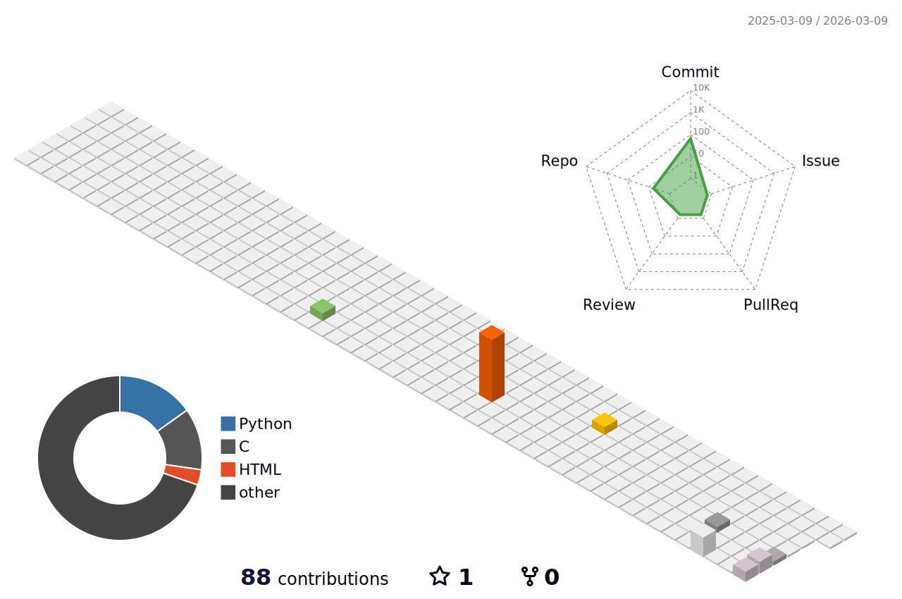

<h1 align="center">Hi 👋, I'm Rohankumar Italiya</h1>
<h3 align="center">AI Student</h3>

  

---

## 🚀 About Me

- 🔭 **Currently Working:** [Autonomous RosBot Navigation in Webots](https://github.com/rohi1810/ROSbotWebots) - Time-optimal path planning with constraint avoidance
- 🌱 **Learning:** Advanced Robotics, Computer Vision, Deep Learning
- 👨‍💻 **Portfolio:** [rohan-italiya.netlify.app](https://rohan-italiya.netlify.app/)
- 💡 **Interests:** Autonomous Systems, Machine Learning, Full-Stack Development

---

## 📊 GitHub Analytics

### 📈 GitHub Stats

  <!-- Top: 3D Chart -->
  
  
    
  
  <!-- Bottom: Stats side by side -->
  
  

---
## 🛠️ Tech Stack

| 🤖 AI & Data Science | 🧠 Machine Learning |
|---------------------|---------------------|
|  **Python**  **OpenCV**  **Pandas** |  **PyTorch**  **TensorFlow**  **Scikit-learn** |

 

| 🌐 Frontend Development | 🔧 Backend & Databases |
|------------------------|------------------------|
|  **React**  **JavaScript**  **HTML5** |  **Node.js**  **Java**  **MongoDB** |

 

| ☁️ Cloud & DevOps | 📱 Mobile & Tools |
|------------------|------------------|
|  **AWS**  **Docker**  **Jenkins** |  **Android**  **Kotlin**  **Linux** |

---

## 🤝 Connect With Me

  
  
  
  

