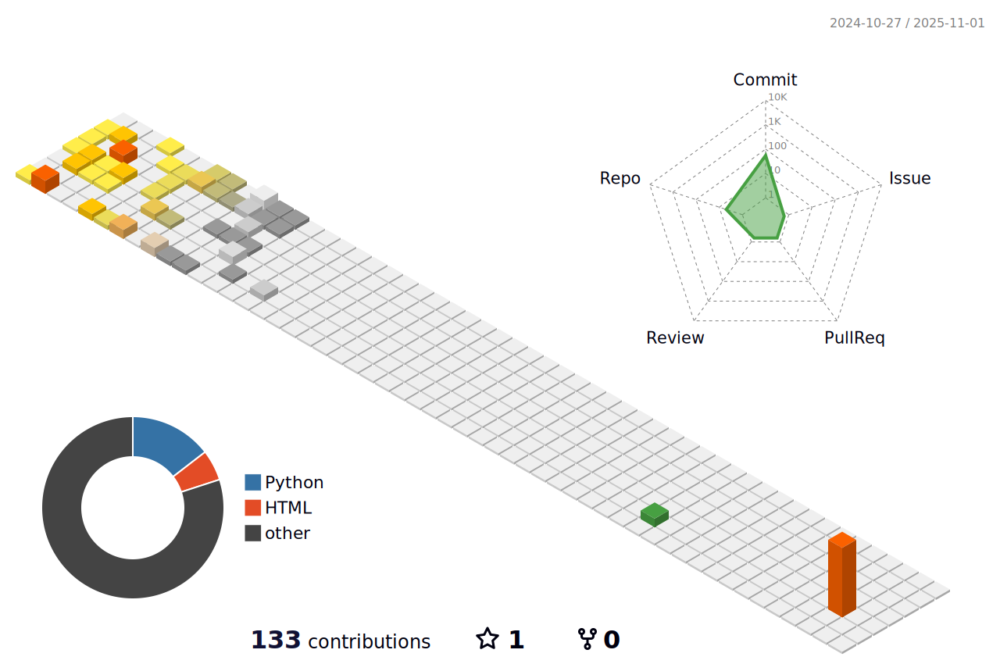

<h1 align="center">Hi 👋, I'm Rohankumar Italiya</h1>
<h3 align="center">AI Student</h3>

  

---

## 🚀 About Me

- 🔭 **Currently Working:** [Autonomous RosBot Navigation in Webots](https://github.com/rohi1810/ROSbotWebots) - Time-optimal path planning with constraint avoidance
- 🌱 **Learning:** Advanced Robotics, Computer Vision, Deep Learning
- 👨‍💻 **Portfolio:** [rohan-italiya.netlify.app](https://rohan-italiya.netlify.app/)
- 💡 **Interests:** Autonomous Systems, Machine Learning, Full-Stack Development

---

## 📊 GitHub Analytics

### 📈 GitHub Stats

  <!-- Top: 3D Chart -->
  
  
    
  
  <!-- Bottom: Stats side by side -->
  
  

---

## 🛠️ Tech Stack
## 🛠️ Tech Stack

### 🤖 AI & Machine Learning

  
  
  
  
  
  

### 🌐 Web & 📱 Mobile Development

  
  
  
  
  
  

### 🗄️ Backend & ☁️ Cloud

  
  
  
  
  
  

### 🔧 DevOps & Tools

  
  
  
  
  

---

## 🤝 Connect With Me

  
  
  
  

